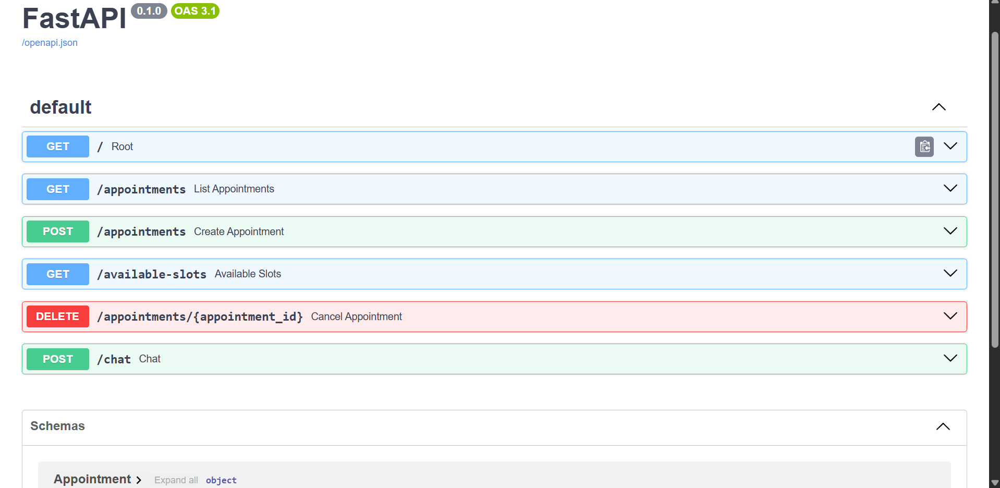
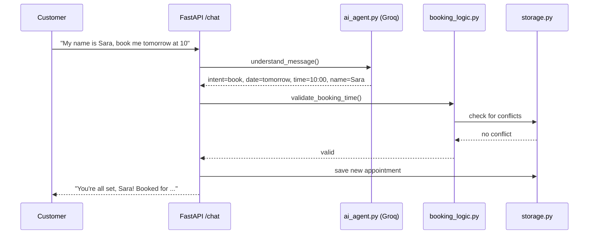

# 📅 AI Appointment Booking Agent

> A conversational AI agent that understands natural-language messages (Arabic or English), checks real availability, and books or cancels appointments automatically.

[](https://python.org)
[](https://fastapi.tiangolo.com)
[](https://groq.com)
[](https://www.docker.com)
[](LICENSE)

Part of the **AI Business Automation Suite**.

---

## Preview


*(Add a screenshot of the `/docs` Swagger UI or a sample `/chat` conversation here)*

---

## What Is This?

This agent handles appointment scheduling end-to-end through natural conversation:
- Understands what the customer wants in plain language — check availability, book, or cancel
- Extracts the date, time, and customer name from a single free-form message
- Validates every booking against business hours and existing appointments to prevent double-booking
- Replies in the same language the customer used (Arabic or English)

---

## Features

- 🧠 **Natural-language understanding** powered by Groq (Llama 3.3 70B)
- 🌍 **Automatic language matching** — replies in Arabic or English based on the customer's message
- 🚫 **Double-booking prevention** — rejects any time slot that's already taken
- ⏰ **Business hours enforcement** — rejects bookings outside working hours
- 💬 **Single conversational endpoint** (`/chat`) alongside traditional REST endpoints for direct integration
- 🐳 **Dockerized** — one command to run, with `docker-compose` for simplicity
- 🔒 **Secrets kept out of the codebase** via `.env` / `.env.example`

---

## How It Works



---

## Quick Start

### Option 1 — Docker (recommended)

```bash
git clone <your-repo-url>
cd appointment-booking-agent
cp .env.example .env
# edit .env and add your GROQ_API_KEY
docker compose up --build
```

### Option 2 — Local Python

```bash
git clone <your-repo-url>
cd appointment-booking-agent
python -m venv venv
venv\Scripts\activate        # Windows
# source venv/bin/activate   # Mac/Linux
pip install -r requirements.txt
cp .env.example .env
# edit .env and add your GROQ_API_KEY
uvicorn app.main:app --reload
```

Open [http://localhost:8000/docs](http://localhost:8000/docs) for the interactive Swagger UI.

---

## Try It

```bash
curl -X POST http://localhost:8000/chat \
  -H "Content-Type: application/json" \
  -d '{"message": "My name is Ahmed, book me tomorrow at 10 am"}'
```

Arabic works out of the box too:

```bash
curl -X POST http://localhost:8000/chat \
  -H "Content-Type: application/json" \
  -d '{"message": "فيه مواعيد فاضية بكرة الصبح؟"}'
```

---

## Configuration

Fill in `.env` (copy from `.env.example`):

| Variable | Description |
|---|---|
| `GROQ_API_KEY` | Get a free key at [console.groq.com/keys](https://console.groq.com/keys) |

Business hours and slot length are currently set in `app/booking_logic.py`:

```python
WORK_START_HOUR = 9
WORK_END_HOUR = 18
SLOT_MINUTES = 30
```

---

## Project Structure

```
appointment-booking-agent/
├── app/
│   ├── main.py            # FastAPI app + all endpoints
│   ├── models.py          # Appointment data model (Pydantic)
│   ├── storage.py         # In-memory appointment store
│   ├── booking_logic.py   # Shared validation + availability logic
│   └── ai_agent.py        # Natural-language understanding (Groq)
├── Dockerfile
├── docker-compose.yml
├── requirements.txt
├── .env.example
├── .gitignore
└── .dockerignore
```
---

## API Reference

| Method | Endpoint | Description |
|---|---|---|
| `POST` | `/chat` | Main conversational entrypoint — send a natural-language message |
| `GET` | `/appointments` | List all booked appointments |
| `GET` | `/available-slots?day=YYYY-MM-DD` | List free slots for a date |
| `POST` | `/appointments` | Directly book a specific slot (structured JSON) |
| `DELETE` | `/appointments/{id}` | Cancel a booking |

---

## Known Limitations

This version is intentionally kept simple for learning and demo purposes:

- **Storage is in-memory** — all appointments are lost on restart. A production deployment should use a real database (e.g. PostgreSQL) or a real calendar (e.g. Google Calendar API).
- **No authentication** on the endpoints.
- **Single business/single calendar** — no multi-staff support yet.

---

## Roadmap

- [ ] Persistent storage (SQLite/PostgreSQL) instead of in-memory
- [ ] Google Calendar integration for real calendar sync
- [ ] WhatsApp / SMS channel integration
- [ ] Reminder messages before appointments
- [ ] Multi-staff / multi-calendar support

---

## Part of the AI Business Automation Suite

| # | Agent | Status |
|---|---|---|
| 1 | Voice Sales Agent | ✅ Live |
| 2 | WhatsApp Sales Agent | 🚧 In progress |
| 3 | Email Outreach Agent | ✅ Live |
| 4 | **Appointment Booking Agent** (this repo) | ✅ Live |

---
## 👤 Author

Built by **Khaled** 🤙🏽

[](https://github.com/Khaled-fouad0)

---

## 📄 License

MIT — free to use, modify, and distribute.